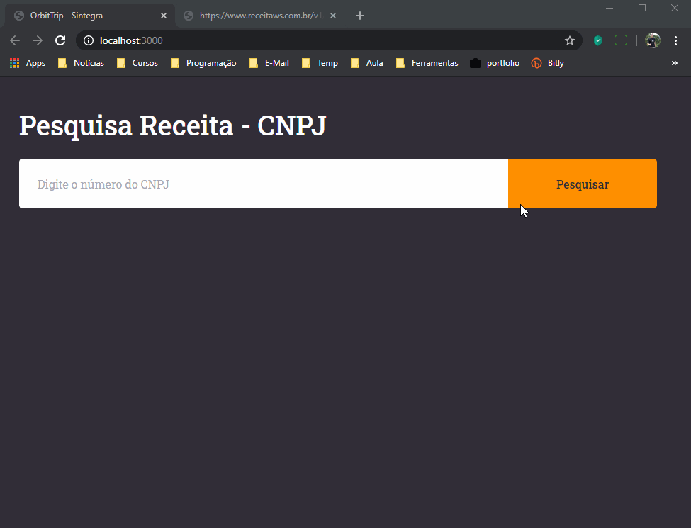

<h1 align="center">
    
    <br>
    Consulta Receita - CNPJ
</h1>

<h4 align="center">
  Sistema desenvolvido utilizando a tecnologia ReactJS.
</h4>

<p align="center">
  <a href="#descrição">Descrição</a>&nbsp;&nbsp;&nbsp;|&nbsp;&nbsp;&nbsp;
  <a href="#tecnologias">Tecnologias</a>&nbsp;&nbsp;&nbsp;|&nbsp;&nbsp;&nbsp;
  <a href="#Como-Usar">Como Usar</a>
</p>

<p align="center">
  
</p>

## Descrição

Este projeto foi desenvolvido para realizar consultar os dados de empresas na [Receita](https://servicos.receita.fazenda.gov.br/Servicos/cnpjreva/Cnpjreva_Solicitacao.asp) através do CNPJ.
Para que a consulta possa ser realizada, está sendo utilizado o Webservice de Dados da [ReceitaWS](https://receitaws.com.br/), consumindo sua API para realizar a consulta. Por se tratar de uma API gratuita, as consultas são limitas a 3 consultas por minutos ou 130000 consultas por mês, conforme descrito em sua documentação, porém eles possuem assinaturas de planos para aumentar esse limite de consultas, podendo até ser limitado.

## Tecnologias

Neste projeto foram utilizadas as seguintes tecnologias:

- [ReactJS](https://reactjs.org/)
- [axios](https://github.com/axios/axios)
- [react-router-dom](https://reacttraining.com/react-router/web/guides/quick-start)
- [styled-components](https://www.styled-components.com/)
- [polished](https://polished.js.org/)
- [VS Code][vc] com [EditorConfig][vceditconfig], [ESLint][vceslint] e [Prettier][vcprettier]

## Como Usar

Para clonar e executar este aplicativo, você precisará [Git](https://git-scm.com), [Node.js v12.16.2][nodejs] ou superior + [Yarn 1.22.4][yarn] ou superior instalado no seu computador. Executar no seu terminal:

```bash
# Para clonar este repositório
$ git clone https://github.com/osterloh/consulta-receita-web

# Entrar no repositório
$ cd consulta-receita-web

# Instalar as dependências
$ yarn

#  Executar o sistema
$ yarn start
```

---

Desenvolvido por [Johnatan Luiz Osterloh](https://www.linkedin.com/in/johnatanosterloh/)

[nodejs]: https://nodejs.org/
[yarn]: https://yarnpkg.com/
[vc]: https://code.visualstudio.com/
[vceditconfig]: https://marketplace.visualstudio.com/items?itemName=EditorConfig.EditorConfig
[vceslint]: https://marketplace.visualstudio.com/items?itemName=dbaeumer.vscode-eslint
[vcprettier]: https://prettier.io/
